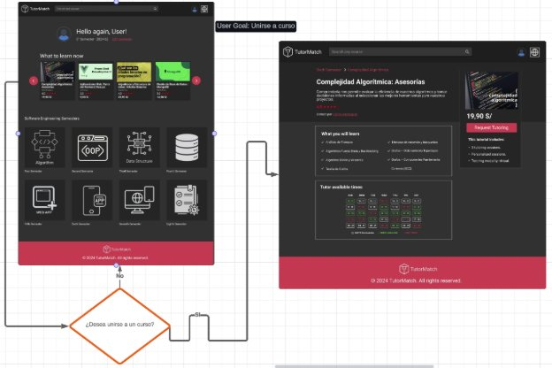
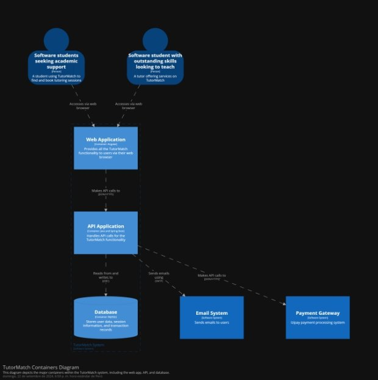

**Capítulo IV: Product Design** 

1. Style Guidelines. 
1. General Style Guidelines. 

El diseño de TutorMatch está orientado a lograr un equilibrio entre profesionalismo y facilidad de uso, ya que está pensado para estudiantes universitarios de Ingeniería de Software de la UPC. 

Branding 

TutorMatch aspira a construir una identidad visual que transmita confianza y evidencie su compromiso con el ámbito académico. La marca debe proyectar una imagen moderna y profesional, resaltando su enfoque en el aprendizaje colaborativo. Para ello, se utilizarán logotipos, íconos y demás elementos gráficos de forma coherente en todas las interfaces y materiales promocionales, fortaleciendo así su presencia visual de manera clara y efectiva. 

Typography 

La elección tipográfica prioriza fuentes sans-serif como Roboto debido a su estilo moderno, sencillo y fácil de leer. Estas tipografías son especialmente adecuadas para entornos web, donde la claridad visual es esencial. Se establecerán jerarquías claras mediante variaciones de tamaño y peso para distinguir títulos, subtítulos y contenido principal, mejorando así la legibilidad y la experiencia de navegación del usuario. 

Colors 

El esquema de colores de TutorMatch ha sido diseñado cuidadosamente para transmitir una imagen de profesionalismo y dinamismo. La paleta incluye los siguientes tonos principales: 

- EF496D (RGB 239, 73, 109): Un rojo vibrante que se usará en botones principales, acciones relevantes y elementos interactivos clave como los llamados a la acción (CTAs). 
- EFA40A (RGB 239, 164, 10): Un tono anaranjado utilizado como color de acento para resaltar íconos y elementos secundarios dentro de la plataforma. 
- 2C242C (RGB 44, 36, 44): Un color oscuro y elegante, ideal para fondos o secciones que requieren una apariencia más sobria y minimalista. 
- 70111E (RGB 112, 17, 30): Rojo oscuro profundo que se emplea en encabezados, bordes u otros elementos que deben destacar de manera discreta. 
- 313131 (RGB 49, 49, 49): Un gris oscuro que sirve como color de fondo principal, generando una base neutra que permite resaltar los demás colores. 
- E33744 (RGB 227, 55, 68): Una variante más suave del rojo principal, utilizada en versiones alternativas de botones y componentes interactivos, manteniendo coherencia visual y variedad en el diseño. 

Este esquema de colores ofrece un equilibrio entre dinamismo y solidez, guiando la atención del usuario hacia los elementos más importantes sin generar una sobrecarga visual. 

Espaciado (Spacing) 

Uno de los pilares del diseño en TutorMatch es la correcta aplicación del espaciado. Al mantener espacios generosos entre los distintos elementos, la interfaz se mantiene limpia, ordenada y fácil de recorrer. Cada botón, sección o bloque de texto contará con márgenes y rellenos bien definidos, lo que no solo mejora la estética, sino también la legibilidad y la navegación intuitiva para el usuario. 

Tono de Comunicación y Lenguaje 

TutorMatch adopta un tono de comunicación que equilibra lo formal y lo casual, siendo respetuoso y entusiasta a la vez. Aunque se reconoce el contexto académico de la plataforma, se busca una voz cercana y accesible para los estudiantes. El mensaje debe transmitir motivación por el aprendizaje, sin dejar de ser cordial y alentador. Este tono se refleja tanto en los textos como en el diseño visual, generando una experiencia cálida y estimulante, sin perder profesionalismo. 

2. Web Style Guidelines. 

La guía de estilo web de TutorMatch establece los principios visuales y de interacción que permiten una experiencia coherente, atractiva y fluida en interfaces adaptables a diferentes dispositivos. Está diseñada para orientar a diseñadores y desarrolladores en la creación de una plataforma responsiva y uniforme. 

Colores 

- Fondo general: Se mantiene un fondo oscuro uniforme (#1E1E1E) en el cuerpo del sitio y sus secciones. 
- Textos: El contenido textual principal se presenta en blanco (#ffffff) para garantizar una lectura clara sobre el fondo oscuro. 
- Elementos destacados: Se utilizan colores llamativos como el rojo (#FA002D y #BC012C) en botones y banners para captar la atención del usuario. 

Tipografía 

- Fuente principal: La fuente sans-serif "Roboto" se emplea en todo el sitio, logrando una apariencia moderna y uniforme. 
- Jerarquía tipográfica: 
- Títulos: Con tamaños grandes para destacarse claramente. 
- Texto normal: Más reducido y jerárquicamente organizado para facilitar la lectura. 

Interacción 

- Efectos de hover y transiciones: Se implementan animaciones suaves (ease-in-out de 0.3 a 0.5 segundos) en botones, imágenes y enlaces, mejorando la interacción. 
- Botones interactivos: Al pasar el cursor, los botones cambian de color o fondo para señalar acciones posibles. 
- Ampliación visual: Imágenes en botones y logotipos aumentan ligeramente su tamaño al hacer hover, lo que mejora su visibilidad. 

Diseño Responsivo 

- Estructura en rejilla: Se aplica un sistema de grid flexible (como grid-template-columns con repeat(auto-fit, minmax(...))) para mantener el orden del contenido en todo tipo de dispositivos. 
- Adaptación a móviles: Gracias a media queries, los elementos ajustan su forma y distribución, incluyendo menús tipo hamburguesa y adaptaciones de espaciado. 
- Navbar adaptable: La barra de navegación es fija y se ajusta a pantallas pequeñas mediante menús colapsables que conservan la funcionalidad. 

Estilo de Componentes 

- Barra de navegación: Se mantiene fija en la parte superior, con un fondo semitransparente y efecto de desenfoque que aporta elegancia. 
- Banners: Incluyen imágenes centradas como fondo para resaltar secciones clave. 
- Secciones del contenido: Se estructuran mediante contenedores (containerH, containerM) que mantienen un ancho máximo del 90% y se centran automáticamente. 

Accesibilidad 

- Contraste visual: El uso de texto claro sobre fondos oscuros garantiza buena visibilidad y mejora la experiencia de personas con dificultades visuales. 
3. Mobile Style Guidelines. 

Las directrices de estilo para dispositivos móviles aseguran que la experiencia de TutorMatch sea fluida, accesible y visualmente coherente en smartphones y tablets. Estas guías se basan en principios de diseño adaptativo, priorizando la legibilidad, usabilidad y estética en entornos móviles, respetando las convenciones específicas de cada sistema operativo. 

1. iOS Mobile Style Guidelines. 

TutorMatch en iOS se alinea con los principios de Human Interface Guidelines de Apple, brindando una experiencia nativa, intuitiva y visualmente atractiva. 

Diseño General 

- Estética clara y minimalista con uso predominante del fondo oscuro (#1E1E1E) y contraste alto. 
- Espaciado generoso y márgenes seguros (Safe Area Insets) para evitar superposición con la barra de estado, navegación y gestos del sistema. 

Tipografía 

- Uso de Roboto como fuente principal (manteniendo coherencia de marca). 
- Tamaños adaptables (UIFontMetrics) según accesibilidad del usuario. 
- Jerarquías claras para encabezados, subtítulos y textos informativos. 

Componentes 

- Botones de acción con bordes suaves (border-radius de 12px) y efectos de tacto visual (haptic feedback) al presionar. 
- Transiciones suaves (ease-in-out 0.3s) en navegación, botones y pantallas modales. 
- Navegación estilo tab bar inferior en apps nativas. 

Interacción 

- Soporte para Dark Mode nativo. 
- Gestos de deslizamiento horizontal para volver atrás o cerrar modales. 
- Animaciones fluidas y consistentes con la estética iOS. 
2. Android Mobile Style Guidelines. 

TutorMatch en Android sigue las recomendaciones de Material Design de Google, buscando funcionalidad y familiaridad para los usuarios de este ecosistema. 

Diseño General 

- Uso de fondo oscuro consistente (#1E1E1E) y componentes con sombras sutiles. 
- Distribución de contenido en columnas responsivas y diseño modular basado en contenedores (ConstraintLayout, MaterialCardView). 

Tipografía 

- Fuente Roboto como tipografía principal, compatible y optimizada para Android. 
- Escalado tipográfico automático con sp (scale-independent pixels) para soporte de accesibilidad. 

Componentes 

- Botones con colores vibrantes (#FA002D, #E33744) y estados visuales para normal, presionado y desactivado. 
- Navegación por bottom navigation bar o navigation drawer dependiendo del flujo de la app. 
- Elevación visual en elementos interactivos como tarjetas, botones flotantes (FAB), y menús. 

Interacción 

- Transiciones suaves utilizando animaciones nativas de Android (MotionLayout, TransitionManager). 
- Soporte completo para Dark Theme y personalización por parte del sistema. 
- Compatibilidad con dispositivos de diferentes resoluciones, asegurando legibilidad en pantallas de baja y alta densidad (hdpi, xhdpi, xxhdpi, xxxhdpi). 
2. Information Architecture. 
1. Organization Systems. 

Los Sistemas de Organización definen cómo se agrupa y estructura la información dentro de la plataforma, afectando directamente la experiencia y la interacción del usuario. En TutorMatch, hemos implementado tres tipos de organización para optimizar la navegación y facilitar el acceso a la información más relevante de manera intuitiva: 

1. Jerarquía Visual:  Este sistema organiza el contenido de mayor a menor importancia, asegurando que los elementos más relevantes sean fácilmente accesibles. En la página de inicio de TutorMatch, las secciones clave, como la búsqueda de tutores y los cursos más solicitados, se presentan de manera destacada en la parte superior o en áreas prominentes de la interfaz. Las informaciones secundarias, como detalles adicionales o enlaces a otras secciones, se colocan en ubicaciones menos visibles para mantener el enfoque en lo principal. 
1. Organización Secuencial:  Este enfoque guía al usuario a través de un proceso paso a paso. Lo utilizamos cuando el usuario debe seguir un conjunto de acciones en orden lógico. Por ejemplo, al buscar un tutor, programar una sesión y realizar un pago, cada uno de estos pasos se presenta de manera clara y estructurada para que el usuario sepa exactamente qué hacer a continuación. Esto reduce la confusión y mejora la eficiencia del proceso. 
1. Organización Matricial: 

   ` `Ideal para situaciones en las que hay múltiples opciones disponibles, este sistema permite filtrar y clasificar la información según criterios específicos. En la búsqueda de tutores de TutorMatch, los usuarios pueden aplicar filtros como especialidad, nivel de curso, o disponibilidad, lo que facilita la búsqueda de opciones más precisas y reduce la sobrecarga de información, permitiendo a los usuarios encontrar exactamente lo que necesitan de manera más rápida y eficiente. 

2. Labeling Systems. 

Los Sistemas de Etiquetado en TutorMatch consisten en las etiquetas o palabras clave utilizadas para identificar y clasificar diferentes tipos de información dentro de la plataforma. La claridad y simplicidad son esenciales para asegurar que los usuarios puedan navegar sin confusión, lo que implica usar etiquetas concisas y comprensibles. A continuación, algunos ejemplos de cómo se implementan: 

- Etiquetas en los Perfiles de Tutores: 
- "Disponible": Esta etiqueta se utiliza para indicar si un tutor está disponible para ser contactado o programar una sesión en tiempo real. 
- "Especialidad": Cada tutor tiene asignada una etiqueta que refleja su área de experiencia o el curso en el que se especializa, como "Complejidad Algorítmica", "Sistemas Opertavios", o "Estructuras de datos". 
- Etiquetas en los Cursos: 
- Para simplificar la búsqueda y organización de los cursos, se utilizan etiquetas descriptivas que representan el contenido de manera clara y precisa, como: 
- "Complejidad Algorítmica" 
- "Estructuras de Datos" 

En lugar de describir extensamente los cursos, estas etiquetas permiten a los estudiantes encontrar rápidamente lo que buscan, sin tener que leer descripciones largas. 

3. SEO Tags and Meta Tags 

Las SEO Tags y Meta Tags son esenciales para mejorar la visibilidad de nuestro sitio en los motores de búsqueda y atraer a los usuarios que buscan tutorías o cursos específicos. Estas etiquetas aseguran que TutorMatch sea fácilmente accesible a través de plataformas como Google. A continuación, detallamos algunos ejemplos de las etiquetas que implementamos: 

- Título (Title Tag): 
- "Encuentra Tutores en UPC | TutorMatch" 
- Este título es claro y atractivo, destacando tanto el propósito de la plataforma como su relación con la UPC, lo que ayuda a los usuarios a identificar rápidamente el servicio. 
- Meta Descripción: 
- "Conéctate con estudiantes de Ingeniería de Software en UPC que ofrecen tutorías en cursos clave como algoritmos y estructuras de datos." 
- La meta descripción es una breve introducción a lo que ofrece el sitio, diseñada para atraer clics desde los resultados de búsqueda. Es clara, concisa y contiene información relevante sobre los servicios de la plataforma. 
- Palabras Clave (Keywords): 
- "TutorMatch, tutores UPC, ayuda en ingeniería de software, tutorías en algoritmos, tutorías en estructuras de datos" 
- Utilizamos palabras clave relevantes que los usuarios podrían buscar al buscar tutorías o ayuda en cursos específicos. Estas palabras clave ayudan a que TutorMatch se posicione en los resultados de búsqueda para esos términos. 
- Autor: 
- "Equipo de TutorMatch" 
- Incluir el autor del sitio ayuda a establecer autoridad y credibilidad, mostrando que el contenido está respaldado por un equipo dedicado y profesional. 

Estas etiquetas son fundamentales para optimizar el sitio en términos de SEO, mejorando su posicionamiento y haciendo que los usuarios puedan encontrar TutorMatch de manera más eficiente. 

4. Searching Systems. 

Los Sistemas de Navegación determinan cómo los usuarios interactúan y se mueven por la plataforma para alcanzar sus objetivos de manera eficiente. El diseño de la navegación en TutorMatch se centra en la simplicidad y la accesibilidad: 

- Barra de Navegación Principal: 
- Esta barra se ubica en la parte superior de la pantalla y ofrece enlaces directos a las secciones más importantes de la plataforma, 
- Los usuarios pueden acceder fácilmente a cualquier parte del sitio en cualquier momento a través de esta barra, lo que mejora la fluidez y la experiencia general 

  de navegación. 

- Navegación Móvil: 
- Para los usuarios de dispositivos móviles, hemos implementado un menú tipo "hamburguesa", que se despliega cuando es necesario. Este diseño optimiza el espacio en la pantalla sin sacrificar la accesibilidad, asegurando que la navegación sea igualmente efectiva en dispositivos pequeños. 
5. Navigation Systems. 

Los Sistemas de Búsqueda permiten a los usuarios encontrar lo que necesitan de forma rápida y precisa, facilitando la navegación de la plataforma. Hemos implementado un sistema robusto y fácil de usar que incluye: 

- Barra de Búsqueda Global: 
- Esta barra de búsqueda está disponible en toda la plataforma y permite a los usuarios escribir directamente lo que buscan, como el nombre de un tutor o un curso específico, como "Base de Datos". Su ubicación accesible en todas las páginas facilita la búsqueda en cualquier momento. 
- Filtros de Búsqueda: 
- Después de realizar una búsqueda, los usuarios pueden afinar los resultados mediante filtros que incluyen opciones como: 
- Especialidad del tutor 
- Calificación del tutor 
- Disponibilidad de horarios 
- Estos filtros permiten a los usuarios encontrar rápidamente los resultados más relevantes según sus necesidades. 
- Resultados Claros: 
- Los resultados de búsqueda se presentan en un formato claro y comprensible, destacando información clave, como: 
- Nombre del tutor 
- Especialización 
- Calificación del tutor 
- Este formato sencillo y accesible permite a los usuarios tomar decisiones rápidas y bien informadas sobre qué tutor elegir. 
3. Landing Page UI Design. 
1. Landing Page Wireframe. 

2. Landing Page Mock-up. 

4. Mobile Applications UX/UI Design. 

El diseño UX/UI de la aplicación móvil busca ofrecer una experiencia intuitiva, funcional y atractiva para el usuario, asegurando una navegación sencilla y eficiente. Por ello, a través de prototipos y mockups de alta fidelidad, se han definido las pantallas, flujos de navegación y elementos visuales que garantizarán una interacción fluida y coherente con los objetivos del aplicativo. 

1. Mobile Applications Wireframes. 

En esta sección desarrollamos los wireframes para definir una versión inicial en el diseño del aplicativo móvil.[ https://www.figma.com/design/u1CLy39Kg9DlyplFzrtbFS/Tutormatch- Mobile-Design?node-id=0-1&t=pjbFTC6Upbm6hJ3e-1 ](https://www.figma.com/design/u1CLy39Kg9DlyplFzrtbFS/Tutormatch-Mobile-Design?node-id=0-1&t=pjbFTC6Upbm6hJ3e-1) 

2. Mobile Applications Wireflow Diagrams. 

En este apartado se realiza una representacion visual de la navegacion de los usuarios en dispositivos móviles. 

[https://lucid.app/lucidchart/c20bf8c9-568d-4ea8-befe-f575de6d73df/edit?viewport_loc=- 9029%2C-379%2C11123%2C5029%2C0_0&invitationId=inv_669e04e7-0772-41cd-b4b1- 665cc1fedaea ](https://lucid.app/lucidchart/c20bf8c9-568d-4ea8-befe-f575de6d73df/edit?viewport_loc=-9029%2C-379%2C11123%2C5029%2C0_0&invitationId=inv_669e04e7-0772-41cd-b4b1-665cc1fedaea) 

User Goal: Crear Usuario 

User Goal: Unirse a un curso de tutorías 

User Goal: Crear curso 

3. Mobile Applications Mock-ups. 

En esta sección desarrollamos los Mock-ups del aplicativo móvil, los cuales permiten ofrecer un mayor nivel de detalle en comparación a los Wireframes. [https://www.figma.com/design/u1CLy39Kg9DlyplFzrtbFS/Tutormatch-Mobile-Design?node- id=19-135&t=pjbFTC6Upbm6hJ3e-1 ](https://www.figma.com/design/u1CLy39Kg9DlyplFzrtbFS/Tutormatch-Mobile-Design?node-id=19-135&t=pjbFTC6Upbm6hJ3e-1) 

4. Mobile Applications User Flow Diagrams. 

Los diagramas de flujo de usuario (user flow diagrams) permiten visualizar de manera clara el recorrido que realiza un usuario dentro de la aplicación móvil para completar una determinada tarea.[ https://lucid.app/lucidchart/0a2f1a00-156e-4138-b3fb-bfce48512406/edit?viewport_loc=- 5728%2C-1075%2C11191%2C5060%2C0_0&invitationId=inv_7a8d9a45-dcf7-4796-b07f- 2f9852387b2d ](https://lucid.app/lucidchart/0a2f1a00-156e-4138-b3fb-bfce48512406/edit?viewport_loc=-5728%2C-1075%2C11191%2C5060%2C0_0&invitationId=inv_7a8d9a45-dcf7-4796-b07f-2f9852387b2d) 

User Goal: Crear cuenta 

El usuario ingresa directamente con su correo y contraseña si ya dispone de una cuenta; caso contrario, tendrá que registrarse. 

User Goal: Unirse a curso 

El usuario registrado estudiante como estudiante selecciona un curso para ver la información sobre las tutorías que este presenta y si el estudiante desea unirse se dirigirá al botón “Request Tutoring” para solicitar su inscripción. 

User Goal: Crear curso 

El proceso está diseñado para permitir a los tutores crear cursos de manera eficiente en la menor cantidad de pasos posibles, evitando saturar la aplicación móvil con múltiples pantallas. 

5. Mobile Applications Prototyping. 

En esta sección se presentan los prototipos para versiones iOS y Android de la aplicación móvil. [https://www.figma.com/design/u1CLy39Kg9DlyplFzrtbFS/Tutormatch-Mobile-Design?node- id=6-106&t=G2i8SO4KP5IJ5Bpt-1 ](https://www.figma.com/design/u1CLy39Kg9DlyplFzrtbFS/Tutormatch-Mobile-Design?node-id=6-106&t=G2i8SO4KP5IJ5Bpt-1) 

1. Android Mobile Applications Prototyping. 

La siguiente presentación de prototipos se divide, tomando como base los User Flow Diagramas y los User Goals, en 3 secciones. En primer lugar, se presenta la serie de pasos que el usuario seguirá para crear un cuenta y registrarse en la aplicación. En segundo lugar, se presentan los pasos que seguirá un tutor para crear un nuevo curso de tutorías o acceder a uno ya creado para editar sus datos. Por último, se presentan los pasos que seguirá un estudiante para solicitar la inscripción a un curso de tutorías. 

[https://upcedupe- my.sharepoint.com/:v:/g/personal/u202218167_upc_edu_pe/EU7RXDUvRBJHoVGwHWBjo20 Br25p15TC3O_KxYzb1oASjw?e=mbl5uX&nav=eyJyZWZlcnJhbEluZm8iOnsicmVmZXJyYW xBcHAiOiJTdHJlYW1XZWJBcHAiLCJyZWZlcnJhbFZpZXciOiJTaGFyZURpYWxvZy1MaW 5rIiwicmVmZXJyYWxBcHBQbGF0Zm9ybSI6IldlYiIsInJlZmVycmFsTW9kZSI6InZpZXcifX0 %3D ](https://upcedupe-my.sharepoint.com/:v:/g/personal/u202218167_upc_edu_pe/EU7RXDUvRBJHoVGwHWBjo20Br25p15TC3O_KxYzb1oASjw?e=mbl5uX&nav=eyJyZWZlcnJhbEluZm8iOnsicmVmZXJyYWxBcHAiOiJTdHJlYW1XZWJBcHAiLCJyZWZlcnJhbFZpZXciOiJTaGFyZURpYWxvZy1MaW5rIiwicmVmZXJyYWxBcHBQbGF0Zm9ybSI6IldlYiIsInJlZmVycmFsTW9kZSI6InZpZXcifX0%3D) 

2. iOS Mobile Applications Prototyping. 

La siguiente presentación de prototipos representa los mismos escenarios que la versión de Android explicada anteriormente, teniendo como única diferencia las dimensiones de la pantalla y determinados elementos. 

[https://upcedupe- my.sharepoint.com/:v:/g/personal/u202218167_upc_edu_pe/Ed8SbHmYEL5Nrvp9mf- IikcBjP2zhXe9KYRXzqv1vNBbGA?e=hI5fDW&nav=eyJyZWZlcnJhbEluZm8iOnsicmVmZXJ yYWxBcHAiOiJTdHJlYW1XZWJBcHAiLCJyZWZlcnJhbFZpZXciOiJTaGFyZURpYWxvZy1 MaW5rIiwicmVmZXJyYWxBcHBQbGF0Zm9ybSI6IldlYiIsInJlZmVycmFsTW9kZSI6InZpZX cifX0%3D ](https://upcedupe-my.sharepoint.com/:v:/g/personal/u202218167_upc_edu_pe/Ed8SbHmYEL5Nrvp9mf-IikcBjP2zhXe9KYRXzqv1vNBbGA?e=hI5fDW&nav=eyJyZWZlcnJhbEluZm8iOnsicmVmZXJyYWxBcHAiOiJTdHJlYW1XZWJBcHAiLCJyZWZlcnJhbFZpZXciOiJTaGFyZURpYWxvZy1MaW5rIiwicmVmZXJyYWxBcHBQbGF0Zm9ybSI6IldlYiIsInJlZmVycmFsTW9kZSI6InZpZXcifX0%3D)

6. Web Applications UX/UI Design. 

A continuación, se presentan los mosaicos y diseños que serán utilizados como guía para el desarrollo de la aplicación web. 

1. Web Applications Wireframes. 

Las vistas iniciales a la aplicación web se desarrollaron en el siguiente enlace: [https://www.figma.com/design/Kt1QYCPfNt4kGlT2hrw2Lk/TutorMatch?node-id=0- 1&t=CzF5SqsyvLSmfIkK-1 ](https://www.figma.com/design/Kt1QYCPfNt4kGlT2hrw2Lk/TutorMatch?node-id=0-1&t=CzF5SqsyvLSmfIkK-1)

Segmento Alumno 

Segmento Tutor: 

2. Web Applications Wireflow Diagrams. 

A continuación, se expresa la representación visual de la navegación de los usuarios. [https://lucid.app/lucidchart/f27f1597-02ac-46fd-8a5a-64edcb56468d/edit?viewport_loc=- 348%2C-5%2C2219%2C1039%2C0_0&invitationId=inv_b833b9f1-f24b-41fa-a6f1- 8d165ab346cd ](https://lucid.app/lucidchart/f27f1597-02ac-46fd-8a5a-64edcb56468d/edit?viewport_loc=-348%2C-5%2C2219%2C1039%2C0_0&invitationId=inv_b833b9f1-f24b-41fa-a6f1-8d165ab346cd) 

User Goal: Crear Usuario 

User Goal: Unirse a curso 

User Goal: Crear curso 

3. Web Applications Mock-ups. 

![ref5]

![ref6]

4. Web Applications User Flow Diagrams. 

Los diagramas de flujo presentados permiten visualizar de manera clara el recorrido que realiza un usuario dentro de la aplicación web para cumplir determinados objetivos. [https://lucid.app/lucidchart/1e0fa7b1-71ed-4100-b6a2- d1c2a80980e2/edit?viewport_loc=284%2C682%2C4960%2C2216%2C0_0&invitationId=inv_c 51626df-9142-48c9-9a36-8c01f80ce266 ](https://lucid.app/lucidchart/1e0fa7b1-71ed-4100-b6a2-d1c2a80980e2/edit?viewport_loc=284%2C682%2C4960%2C2216%2C0_0&invitationId=inv_c51626df-9142-48c9-9a36-8c01f80ce266)

User Goal: Crear Cuenta 

Explicación: Este flujo ideal muestra cómo un nuevo usuario puede registrarse de manera rápida y sencilla en TutorMatch. Todo funciona como se espera, sin ningún obstáculo o error que interrumpa el proceso. 

User Goal: Unirse a curso 

Explicación: Un usuario registrado en TutorMatch puede explorar una variedad de cursos, filtrarlos por sus intereses y seleccionar el que más le convenga. Una vez elegido el curso, puede inscribirse fácilmente completando un formulario de registro. 

User Goal: Crear curso 

Explicación: El proceso está diseñado para ser intuitivo y permitir a los tutores crear cursos de manera eficiente. La plataforma ofrece herramientas y guías para facilitar este proceso y asegurar la calidad de los cursos. 

7. Web Applications Prototyping. 

A continuación presentamos los prototipos designados para la landing page y aplicación web.  

[https://upcedupe- my.sharepoint.com/:v:/g/personal/u202218167_upc_edu_pe/EdKCNuLoVaJPgNwY6rKfAYsBC DvIGjBZ8C5A3tpnHlLHSQ?e=BS9mX9&nav=eyJyZWZlcnJhbEluZm8iOnsicmVmZXJyYWx BcHAiOiJTdHJlYW1XZWJBcHAiLCJyZWZlcnJhbFZpZXciOiJTaGFyZURpYWxvZy1MaW5 rIiwicmVmZXJyYWxBcHBQbGF0Zm9ybSI6IldlYiIsInJlZmVycmFsTW9kZSI6InZpZXcifX0 %3D ](https://upcedupe-my.sharepoint.com/:v:/g/personal/u202218167_upc_edu_pe/EdKCNuLoVaJPgNwY6rKfAYsBCDvIGjBZ8C5A3tpnHlLHSQ?e=BS9mX9&nav=eyJyZWZlcnJhbEluZm8iOnsicmVmZXJyYWxBcHAiOiJTdHJlYW1XZWJBcHAiLCJyZWZlcnJhbFZpZXciOiJTaGFyZURpYWxvZy1MaW5rIiwicmVmZXJyYWxBcHBQbGF0Zm9ybSI6IldlYiIsInJlZmVycmFsTW9kZSI6InZpZXcifX0%3D) 

8. Domain-Driven Software Architecture. 
1. Software Architecture Context Diagram. 

El diagrama de contexto proporciona una perspectiva general de las interacciones entre la plataforma TutorMatch y sus distintos usuarios. Representa las conexiones clave con los perfiles que acceden al sistema, como estudiantes y tutores, así como posibles vínculos con servicios o sistemas externos. 

2. Software Architecture Container Diagrams. 

El diagrama de contenedores muestra una vista de las relaciones entre la página principal de TutorMatch, la aplicación web, el gateway de API y los contextos delimitados que forman parte de la arquitectura del sistema TutorMatch. 

3. Software Architecture Components Diagrams. 

9. Software Object-Oriented Design. 
1. Class Diagrams. 

2. Class Dictionary. 
1. Clase Tutor 

|**Atributo** |**Tipo de variable** |**Descripción** |
| - | - | - |
|idTutor |int |Identificador único del tutor. |
|name |String |Nombre del tutor. |
|surname |String |Apellido del tutor. |
|email |String |Correo electrónico del tutor. |
|password |String |Contraseña del tutor para autenticación. |
|avatar |String |Imagen de perfil del tutor. |
|gender |String |Género del tutor. |
|cycle |String |Ciclo académico del tutor. |

2. Clase Learner 

|Atributo |Tipo de variable |Descripción |
| - | - | - |
|idLearner |int |Identificador único del aprendiz. |
|name |String |Nombre del aprendiz. |
|surname |String |Apellido del aprendiz. |
|email |String |Correo electrónico del aprendiz, utilizado para autenticación. |
|password |String |Contraseña del aprendiz para autenticación. |
|avatar |String |Imagen de perfil del aprendiz. |
|gender |String |Género del aprendiz. |
|cycle |String |Ciclo académico del aprendiz.  |

3. Clase Course 

|**Atributo** |**Tipo de variable** |**Descripción** |
| - | - | - |
|idCourse |int |Identificador único del curso. |
|name |String |Nombre del curso. |
|cycle |String |Ciclo académico en el que se imparte el curso. |
|description |String |Descripción del curso. |

4. Clase Post 

|**Atributo** |**Tipo de variable** |**Descripción** |
| - | - | - |
|idPost |int |Identificador único de la publicación. |
|title |String |Título de la publicación. |
|description |String |
Descripción de la publicación 

o servicio ofrecido. 
|
|price |decimal |Costo del servicio/tutoría ofrecido en la publicación. |
|image |String |Imagen relacionada a la publicación. |
|idTutor |int |Identificador del tutor asociado a la publicación. |
|idCourse |int |Identificador del curso relacionado a la publicación. |
|idRating |int |Identificador de la calificación asociada. |

5. Clase Review 

|**Atributo** |**Tipo de variable** |**Descripción** |
| - | - | - |
|idReview |int |Identificador único de la reseña. |
|comment |String |Comentario escrito en la reseña. |
|idRating |int |Identificador de la calificación asignada. |
|idLearner |int |Identificador del aprendiz que realiza la reseña. |
|idPost |int |Identificador de la publicación asociada a la reseña. |

6. Clase Rating 

|**Atributo** |**Tipo de variable** |**Descripción** |
| - | - | - |
|idRating |int |Identificador único de la calificación. |
|value |decimal |Valor de la calificación. |

7. Clase Contract 

|**Atributo** |**Tipo de variable** |**Descripción** |
| - | - | - |
|idContract |int |Identificador único del contrato. |
|idSubscription |int |Identificador de la suscripción asociada. |
|startDate |Date |Fecha de inicio del contrato. |
|endDate |Date |Fecha de finalización del contrato. |
|state |String |Estado del contrato. |
|idTutor |int |Identificador del tutor asociado al contrato. |

8. Clase Schedule 

|**Atributo** |**Tipo de variable** |**Descripción** |
| - | - | - |
|idSchedule |int |Identificador único del horario. |
|startHour |DateTime |Hora de inicio de la disponibilidad. |
|endHour |DateTime |Hora de finalización de la disponibilidad. |
|idWeekDay |int |Identificador del día de la semana. |

9. Clase Calendar 

|**Atributo** |**Tipo de variable** |**Descripción** |
| - | - | - |
|idCalendar |int |Identificador único del calendario. |
|idTutor |int |Identificador del tutor asociado al calendario. |

10. Clase WeekDay 

|**Atributo** |**Tipo de variable** |**Descripción** |
| - | - | - |
|idWeekDay |int |Identificador único del día de la semana. |
|name |String |Nombre del día de la semana. |

11. Clase Subscription 

|**Atributo** |**Tipo de variable** |**Descripción** |
| - | - | - |
|idSubscription |int |Identificador único de la suscripción. |
|name |String |Nombre de la suscripción. |
|price |decimal |Precio de la suscripción. |

12. Clase Payment 

|**Atributo** |**Tipo de variable** |**Descripción** |
| - | - | - |
|idPayment |int |Identificador único del pago. |
|amount |decimal |Monto total del pago. |
|paymentDate |Date |Fecha y hora en que se realizó el pago. |
|status |String |Estado del pago. |
|idContract |int |Identificador del contrato asociado al pago. |

10. Database Design. 

4\.10.1. Relational/Non-Relational Database Diagram 

  
